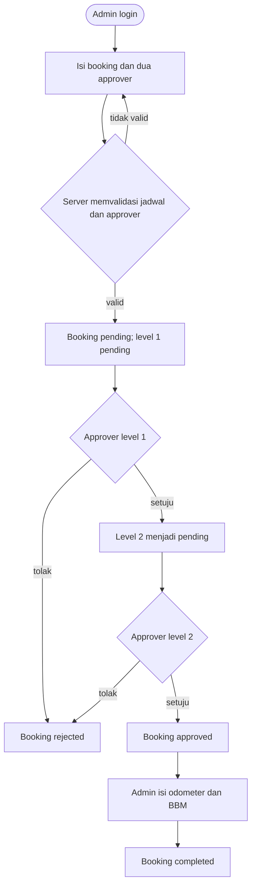

# Activity Diagram Pemesanan

```mermaid
flowchart TD
  A([Admin login]) --> B[Isi booking dan dua approver]
  B --> C{Server memvalidasi jadwal dan approver}
  C -- tidak valid --> B
  C -- valid --> D[Booking pending; level 1 pending]
  D --> E{Approver level 1}
  E -- tolak --> F[Booking rejected]
  E -- setuju --> G[Level 2 menjadi pending]
  G --> H{Approver level 2}
  H -- tolak --> F
  H -- setuju --> I[Booking approved]
  I --> J[Admin isi odometer dan BBM]
  J --> K[Booking completed]
```

Setiap transisi yang mengubah status dilakukan dalam transaksi API dan dicatat ke `activity_logs`.
